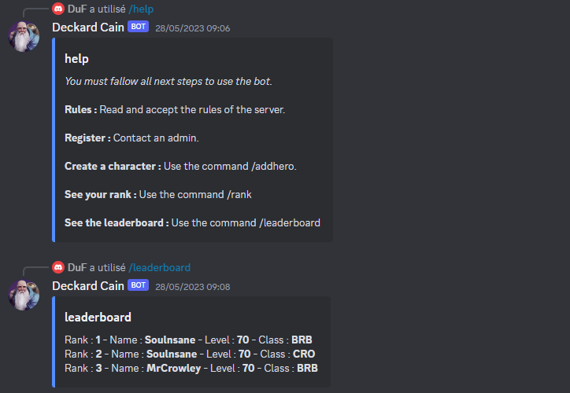

# Discord-Bot

Discord-Bot is an interactive Discord bot designed to manage a ranking system for players of the game Diablo IV. It offers several features, including registration to the ranking system, listing available commands, viewing personal ranking, checking the list of top players, and choosing the type of character.

## Table of Contents

- [Installation Steps](#installation-steps)
- [Key Features](#key-features)
- [screenshots](#screenshots)
- [Technologies](#technologies)

## Installation Steps

To use Discord-Bot, make sure you have the pnpm package manager and Node.js installed. Then, launch the project with the following command:
```bash
docker-compose -f docker-compose.dev.yml up --build
```

## Key Features
- Register to the ranking system
- List available commands
- View personal ranking
- Check the list of top players
- Choose the type of character

## Screenshots


## Technologies
- [Node.js](https://nodejs.org/)
- [JavaScript](https://developer.mozilla.org/en-US/docs/Web/JavaScript)
- [TypeScript](https://www.typescriptlang.org/)
- [Discord.js](https://discord.js.org/)
- [Sequelize](https://sequelize.org/)
